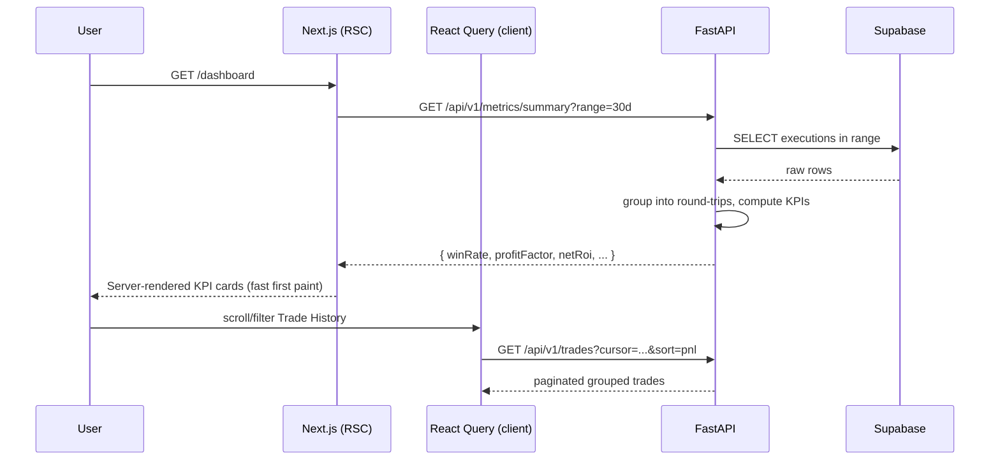

# System Architecture — TradeOpsJournal Redesign

> Target stack: **Next.js (App Router) + React + Tailwind + Shadcn UI** (frontend) ·
> **FastAPI (Python)** (analytics/logic) · **Supabase PostgreSQL** (data).
> Ingestion (IBKR CSV → GitHub Actions → Supabase) is **unchanged** and out of scope.

---

## 1. High-Level Diagram

```mermaid
flowchart LR
    subgraph Ingest["Ingestion (EXISTING - unchanged)"]
        GHA[GitHub Actions\nscripts/ingest.py] -->|upsert| DB[(Supabase\nPostgreSQL)]
    end

    subgraph Client["Browser"]
        NX[Next.js App Router\nReact + Shadcn + Tailwind]
    end

    subgraph Edge["Next.js Server (RSC + Route Handlers)"]
        RSC[Server Components\n+ /api proxy]
    end

    subgraph Logic["FastAPI Analytics Service"]
        API[Metric engine\nTrade grouping, KPIs]
    end

    NX -->|user interactions| RSC
    RSC -->|REST /metrics, /trades| API
    API -->|read SQL| DB
    RSC -.->|optional direct read\n(simple lists, auth)| DB
    NX -.->|Supabase JS\n(realtime/auth only)| DB
```

---

## 2. Responsibility Split (the important part)

| Concern | Owner | Rationale |
|---|---|---|
| **Raw row storage** | Supabase | System of record. No business logic in DB beyond views/indexes. |
| **Authentication / session** | Supabase Auth + Next.js middleware | Single source of identity; JWT passed to FastAPI. |
| **Trade *grouping*** (executions → round-trip positions) | **FastAPI** | Pure logic, FIFO matching, must be testable and reusable by AI layer. |
| **Metric *calculation*** (Win Rate, Profit Factor, ROI, Expectancy) | **FastAPI** | Heavy/derived math lives in one place, not duplicated in UI. |
| **Data shaping for tables/charts** | FastAPI | Returns view-ready DTOs so the frontend stays dumb. |
| **Presentation, sorting, client filtering, pagination UI** | Next.js + TanStack Table | Pure UX; operates on already-computed data. |
| **Caching / revalidation** | React Query (client) + Next.js `revalidate` | Avoids re-hitting FastAPI for every render. |
| **AI insight generation** (future) | FastAPI (LLM orchestration) | Same service already owns trade context + metrics. |

> **Golden rule:** *The frontend never calculates a metric.* If a number requires
> reasoning across multiple executions (PnL, R-multiple, win rate), it is computed in
> FastAPI. The UI only formats and displays.

---

## 3. Two Read Paths (deliberate)

### Path A — Analytics (primary)
`Next.js → FastAPI → Supabase`

Used for everything derived: dashboard KPIs, grouped trade history, equity curve,
per-symbol stats, AI insights. FastAPI reads raw `trades` / `cash_transactions` /
`trade_journal`, runs the metric engine, and returns ready-to-render JSON.

### Path B — Direct Supabase (secondary, optional)
`Next.js (Server Component or Supabase JS) → Supabase`

Reserved for:
- Auth (login/session via Supabase Auth).
- Realtime subscriptions (e.g. "new trade ingested today" toast).
- Trivial CRUD on `trade_journal` (notes, tags, planned stop/target) where no
  computation is needed.

This keeps latency-sensitive writes (journal notes) snappy while routing all
*analysis* through the Python brain.

---

## 4. Request Lifecycle (Dashboard load example)



---

## 5. FastAPI Service Layout

```
backend/
  app/
    main.py                # FastAPI app, CORS, router mounting
    core/
      config.py            # env, Supabase URL/key, JWT verify
      deps.py              # auth dependency, db session
    db/
      supabase_client.py   # service-role client (server-side only)
      queries.py           # raw SQL / supabase-py reads
    domain/
      grouping.py          # executions -> round-trip TradeGroup (FIFO)
      metrics.py           # KPI engine (pure functions, unit-tested)
      models.py            # Pydantic DTOs (TradeGroup, MetricsSummary, ...)
    routers/
      metrics.py           # /metrics/summary, /metrics/equity-curve
      trades.py            # /trades (paginated grouped), /trades/{id}
      journal.py           # /journal (notes/tags upsert)
      insights.py          # /insights  (AI - stubbed for now)
    services/
      ai_coach.py          # FUTURE: LLM orchestration (returns mock today)
  tests/
    test_grouping.py
    test_metrics.py
```

**Key principle:** `domain/metrics.py` and `domain/grouping.py` are **pure**
(no DB, no FastAPI) so they are trivially unit-testable and reusable by the future
AI coach.

---

## 6. Environment & Boundaries

| Variable | Where | Notes |
|---|---|---|
| `SUPABASE_URL` | FastAPI + Next.js | Public. |
| `SUPABASE_ANON_KEY` | Next.js (browser) | Auth + safe reads only (RLS enforced). |
| `SUPABASE_SERVICE_ROLE_KEY` | **FastAPI only** | Never shipped to browser. |
| `NEXT_PUBLIC_API_URL` | Next.js | FastAPI base URL. |
| `JWT_SECRET` / JWKS | FastAPI | Verify Supabase-issued JWT from Next.js. |

- **CORS:** FastAPI allows only the Next.js origin.
- **Auth:** Next.js attaches `Authorization: Bearer <supabase_jwt>` on every FastAPI call; FastAPI verifies it and enforces `user_id` scoping.
- **RLS:** Enable Row Level Security on Supabase so Path B (direct reads) is also safe.

---

## 7. Deployment Topology

| Component | Host (suggested) |
|---|---|
| Next.js | Vercel |
| FastAPI | Fly.io / Render / Railway (container) |
| Supabase | Supabase Cloud |
| Ingestion | GitHub Actions (unchanged) |

Keep FastAPI stateless; scale horizontally. All state lives in Supabase.

---

## 8. Future AI Integration Hook

The `insights` router is wired now but returns deterministic mock data. When the LLM
is added:

1. `services/ai_coach.py` pulls a trader's grouped trades + metrics + journal notes.
2. Builds a context window, calls the LLM, returns structured `Insight[]`.
3. Persists to `ai_coach_insights` (see DATA_MODEL.md) with evidence links back to
   `trade_group_id` for auditability.

No frontend change required — the `<AIInsightPanel/>` already consumes `/insights`.
