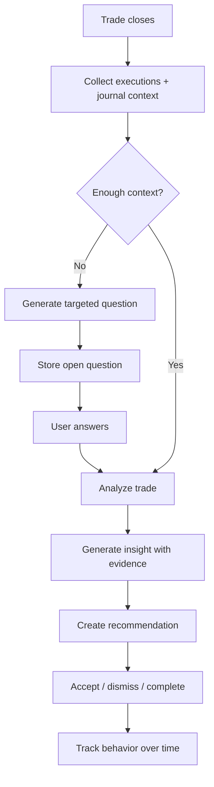

# AI Coaching Vision

## Product Goal

The AI coach should help the trader improve trading skill by reviewing actions, identifying patterns, asking better questions, and turning repeated behavior into clear improvement goals.

The coach should not be positioned as a guaranteed profit engine or automated trading signal provider. Its first role is structured reflection and process improvement.

## Coaching Principles

1. **Evidence first** — every insight should point to trades, journal notes, tags, or metrics.
2. **Ask before assuming** — if intent is unclear, the AI should ask a question instead of inventing motivation.
3. **Small improvements** — recommendations should be specific enough to apply on the next trading day.
4. **Behavior over prediction** — focus on execution quality, risk management, discipline, and review habits.
5. **Track change over time** — improvement is measured by repeated behavior, not one good or bad trade.

## Inputs the AI Should Use

### Current Inputs

- Symbol
- Buy/sell action
- Quantity
- Price
- Execution time
- Realized P&L
- Commission
- Full-trade grouping
- Holding duration
- Daily and symbol-level P&L

### Future Inputs

- Pre-trade plan
- Trade thesis
- Entry reason
- Stop-loss and target plan
- Position sizing logic
- Emotion before entry
- Emotion during management
- Exit reason
- Screenshots
- Setup tags
- Mistake tags
- Market context
- User rules and playbook

## AI Outputs

### Trade Summary

The AI should answer:

- What happened?
- What was the result?
- How long was the trade held?
- What actions are clearly visible from data?
- What information is missing?

### Pattern Detection

The AI should look for repeated patterns such as:

- Entering without a plan.
- Selling winners too early.
- Holding losers too long.
- Oversizing after a loss.
- Trading worse during specific hours.
- Performing better on specific setups.
- Taking low-quality trades after profitable trades.
- Deviating from stated rules.

### Coaching Questions

The AI should ask questions like:

- What was your planned stop before entering this trade?
- Did you enter because of your setup or because of fear of missing out?
- What signal told you to exit here?
- Did you follow the plan you wrote before the trade?
- If you could replay this trade, what one action would you change?
- Was this trade part of your A+ setup list?
- What were you feeling when you increased size?

Each question should include:

- The question.
- Why the AI is asking it.
- The evidence or missing context that triggered it.
- The trade or period it relates to.

### Recommendations

Recommendations should be practical:

- “Before each trade, write the invalidation level. The last 5 losing trades do not include a recorded stop.”
- “Review trades held under 10 minutes. They represent 60% of your losses this week.”
- “You perform better on `setup: breakout pullback` than untagged trades. Tag every trade this week to confirm.”
- “Your exits are not documented. Add an exit reason immediately after closing each trade.”

## AI Workflow



## Prompt Output Contract

The first AI version should return structured output, not only free text.

```json
{
  "summary": "Short factual trade summary.",
  "observations": [
    {
      "type": "fact_or_inference",
      "text": "Observation text.",
      "evidence": ["trade_id_or_journal_entry_id"],
      "confidence": "low | medium | high"
    }
  ],
  "questions": [
    {
      "question": "Question to ask the trader.",
      "reason": "Why this matters.",
      "evidence": ["trade_id_or_metric_id"]
    }
  ],
  "recommendations": [
    {
      "recommendation": "Specific action.",
      "why": "Reasoning.",
      "evidence": ["trade_id_or_journal_entry_id"],
      "timeframe": "next_trade | daily | weekly"
    }
  ]
}
```

## Safety and Privacy Boundaries

- The AI should not claim that a specific trade will be profitable.
- The AI should not place orders or control the broker account.
- The AI should distinguish facts from assumptions.
- The AI should not receive Gmail tokens, Supabase keys, or other secrets.
- The AI should receive only the trade and journal context needed for the coaching task.
- The AI should focus on process, risk, discipline, and learning.

## First AI MVP

The first useful AI MVP should be narrow:

1. User selects one closed trade.
2. App sends executions and journal notes for that trade to AI.
3. AI returns:
   - factual summary,
   - missing-context questions,
   - one improvement recommendation,
   - evidence references.
4. User answers the questions.
5. The answer is stored and used in the next analysis.

## Later AI Versions

### Weekly Review Coach

- Summarize the trading week.
- Identify top recurring mistakes.
- Compare performance by setup and behavior.
- Produce a weekly improvement focus.

### Rule Compliance Coach

- Let the user define trading rules.
- Compare each trade to those rules.
- Track rule violations over time.

### Playbook Builder

- Identify best-performing setups.
- Help write a personal trading playbook.
- Compare future trades to playbook criteria.

### Personalized Training Loop

- Recommend one habit for the next week.
- Check whether the habit was followed.
- Adjust coaching based on actual behavior.
