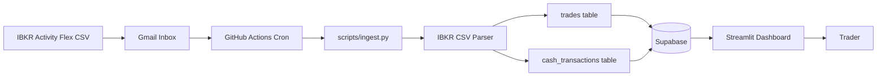
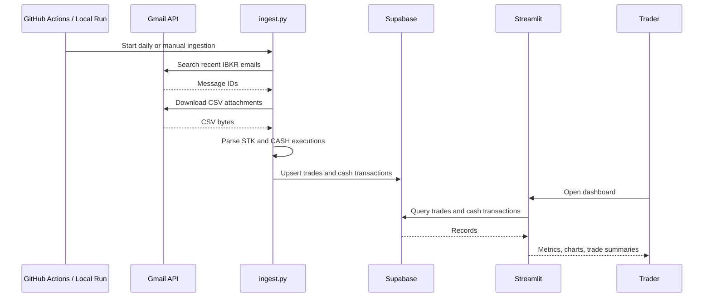
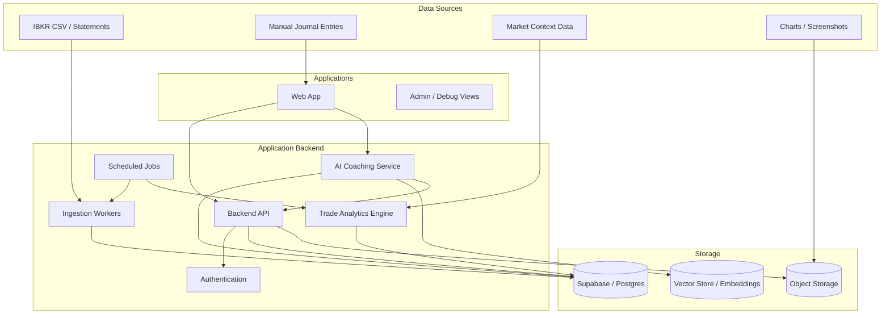

# Architecture

## Overview

TradeOpsJournal currently has three main parts:

1. **Ingestion pipeline** — retrieves IBKR CSV files from Gmail and writes normalized records to Supabase.
2. **Database** — Supabase stores stock executions and cash/FX transactions.
3. **Dashboard** — Streamlit reads Supabase data and presents analytics.

The future target architecture adds a product backend, a richer web application, manual journaling, and an AI coaching layer.

## Current Architecture Diagram



## Current Runtime Components

### Gmail Integration

- Uses Gmail API readonly scope.
- Authenticates with OAuth2 refresh token.
- Searches for IBKR Activity Flex emails.
- Downloads CSV attachments from matching messages.

### Ingestion Script

File: `scripts/ingest.py`

Responsibilities:

- Build Gmail client.
- Find matching IBKR emails.
- Download CSV attachments.
- Parse stock and cash rows.
- Transform rows into Supabase-ready records.
- Deduplicate using `trade_id` and `transaction_id`.
- Upsert data into Supabase.
- Print run summary.

### Supabase

Current tables expected by code:

- `trades`
- `cash_transactions`

Supabase is used as the operational database. The current code uses the service-role key for both ingestion and Streamlit data access.

### Streamlit UI

File: `app/streamlit_app.py`

Responsibilities:

- Load trade and cash data from Supabase.
- Apply date filters.
- Compute metrics and visual summaries.
- Group executions into full trades.
- Render overview, full trade, execution, and cash transaction tabs.

## Current Data Flow



## Target Future Architecture

The target system should support a full application and web application, not only a Streamlit dashboard.



## Target Core Capabilities

### Trading Journal Foundation

- Execution ingestion from IBKR.
- Manual trade plans and post-trade reviews.
- Tags for strategy, setup, market condition, mistake type, and emotion.
- Screenshots and evidence attached to trades.
- Trade lifecycle: planned → opened → managed → closed → reviewed.

### Analytics Engine

- P&L and win-rate metrics.
- Risk/reward metrics.
- Setup-level performance.
- Mistake-level performance.
- Time-of-day and holding-time analysis.
- Discipline metrics, such as whether the trader followed the plan.

### AI Coaching Layer

- Analyze trades and journal entries.
- Detect repeated patterns and mistakes.
- Ask targeted questions when context is missing.
- Produce actionable improvement recommendations.
- Track whether recommendations are followed over time.

## Security Architecture Notes

- Gmail refresh tokens and Supabase service-role keys must remain server-side only.
- A browser-based web app must use user authentication and row-level security, not service-role access.
- AI prompts must avoid exposing secrets and should minimize sensitive account data.
- Trade data is personal financial data and should be treated as private by default.

## Recommended Next Architecture Step

Before building the future AI coach, split the current code into clean layers:

```text
tradeopsjournal/
  ingestion/
  db/
  analytics/
  ui/
  ai/
  tests/
```

This will make the future backend and web app easier to build without rewriting the current functionality.
